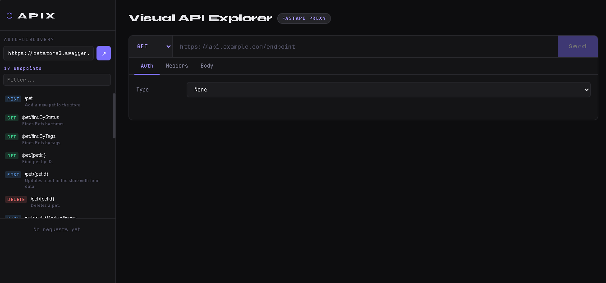
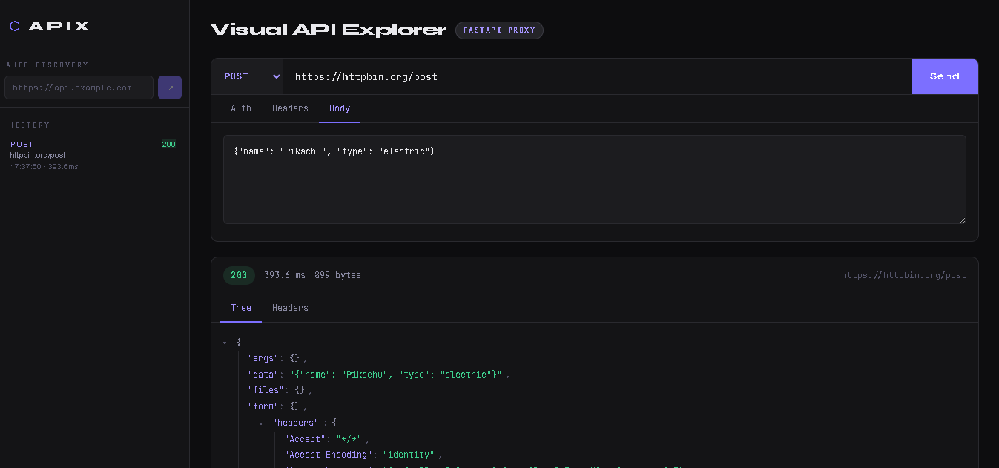
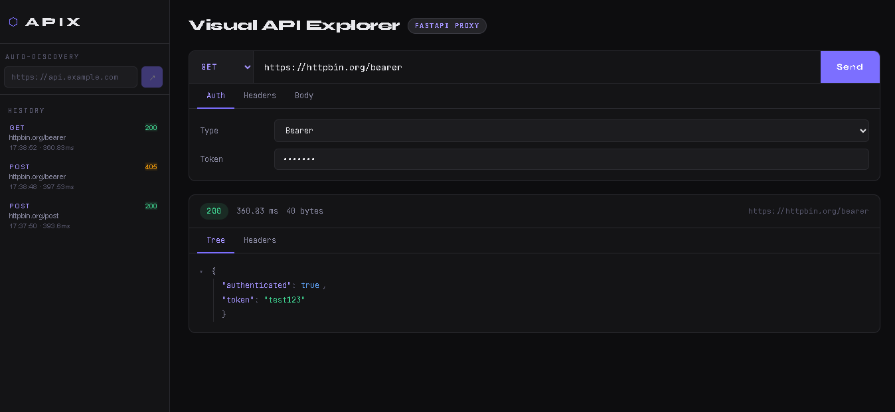
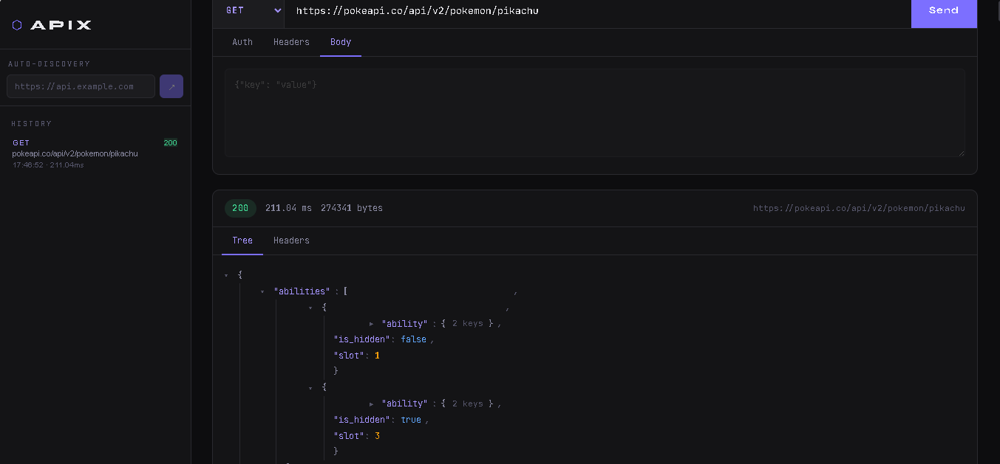
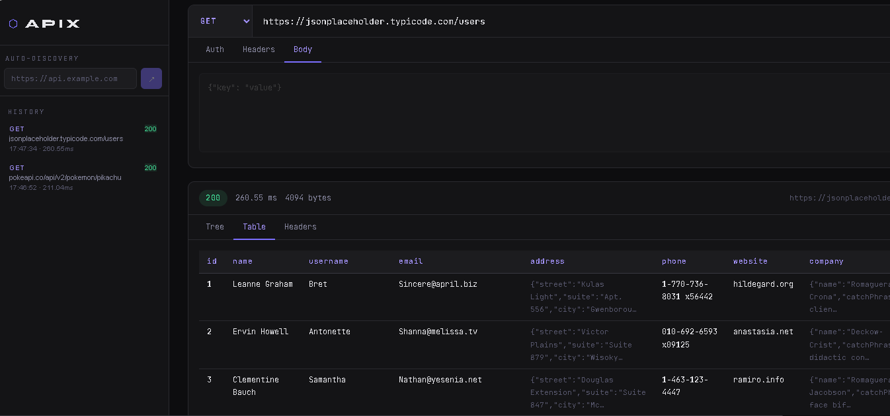

# APIX — Visual API Explorer

> A lightweight Postman alternative built in the browser — with auto-discovery, JSON tree visualization, table view, and a FastAPI proxy to bypass CORS.

---

## Screenshots


*Auto-discover all endpoints from any OpenAPI/Swagger spec*



*Build requests with auth, custom headers, and JSON body*


*Collapsible JSON tree with syntax highlighting*


*Array responses rendered as a clean data table*

---

## Features

### 🔍 Auto-Discovery
Paste any API base URL and APIX automatically fetches its OpenAPI/Swagger spec (`/openapi.json`, `/swagger.json`, `/api-docs`). All endpoints are listed with their method, path, and description. Click any endpoint to instantly populate the request builder.

### 🛠 Request Builder
Full control over every part of your request — HTTP method (GET, POST, PUT, PATCH, DELETE), URL, headers, and JSON body. 

### 🔐 Authentication
Three auth modes, all sent securely via HTTP headers — never exposed in the URL or logs:
- **Bearer** — `Authorization: Bearer <token>`
- **API Key** — any custom header name (e.g. `X-API-Key`)
- **Basic** — `Authorization: Basic <base64>`

### 🌲 JSON Tree View
Responses are rendered as an interactive collapsible tree with syntax coloring for strings, numbers, booleans, and nulls. Deep objects auto-collapse.

### 📊 Table View
When the response is an array of objects, a **Table** tab appears automatically and renders the data as a clean, scrollable table with auto-detected columns.

### 📡 Response Metadata
Every response shows status code (color-coded), response time in ms, size in bytes, and the final resolved URL.

### 🕓 Request History
The last 20 requests are saved in the sidebar. Click any entry to reload the URL, method, and response instantly.

### 🔄 CORS Proxy
All requests go through a local FastAPI proxy — no browser CORS errors, no browser extensions needed.

---

## Setup

**Backend**
```bash
cd backend
python -m venv venv && source venv/bin/activate  # Windows: venv\Scripts\activate
pip install -r requirements.txt
uvicorn main:app --reload --port 8000
```

**Frontend**
```bash
cd frontend
npm install && npm run dev
```

Open `http://localhost:5173` — backend must be running on port `8000`.

---

## Tech Stack

| Layer | Tech |
|---|---|
| Frontend | React 18, Vite |
| Backend | FastAPI, httpx |


## 👤 Author

**Souhail HMAHMA** — Full Stack Developer

🌐 [souhail3.vercel.app](https://souhail3.vercel.app) · 💼 [LinkedIn](https://linkedin.com/in/souhail-hmahma) · 🐙 [GitHub](https://github.com/souhmahma)
